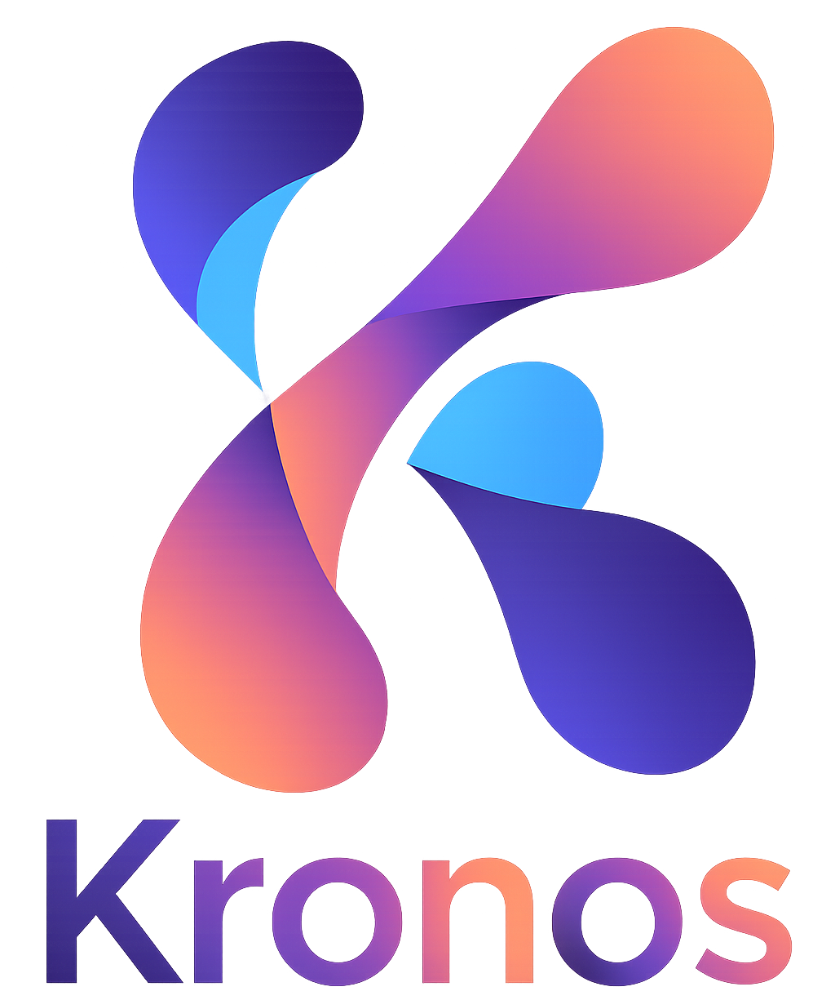
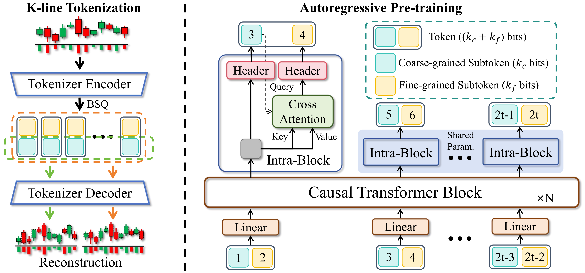
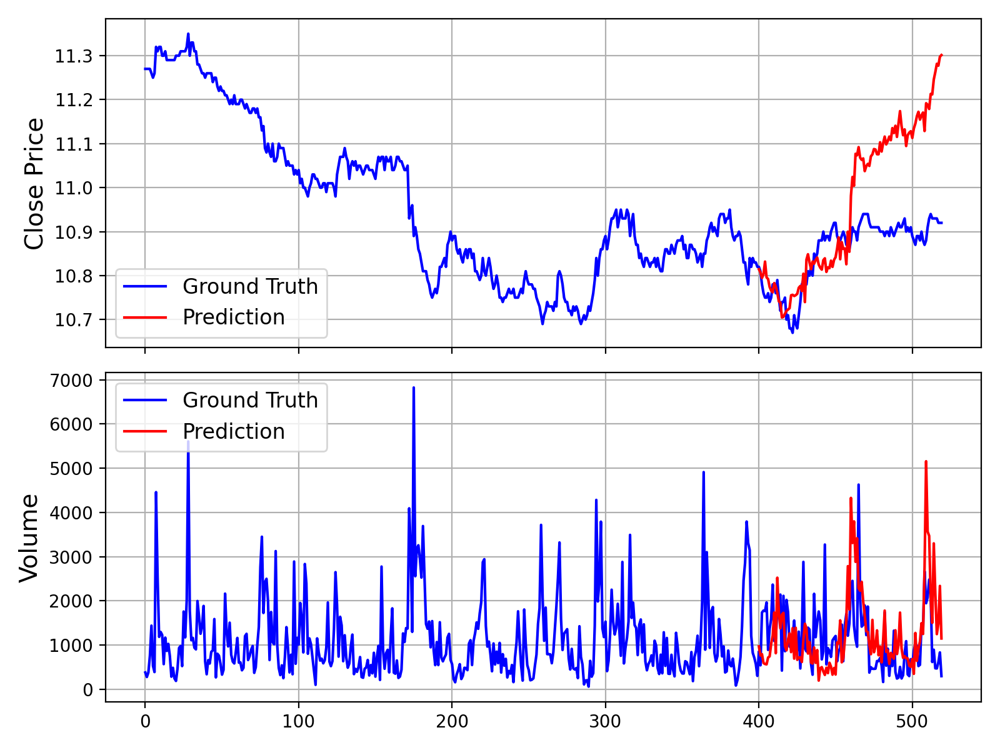
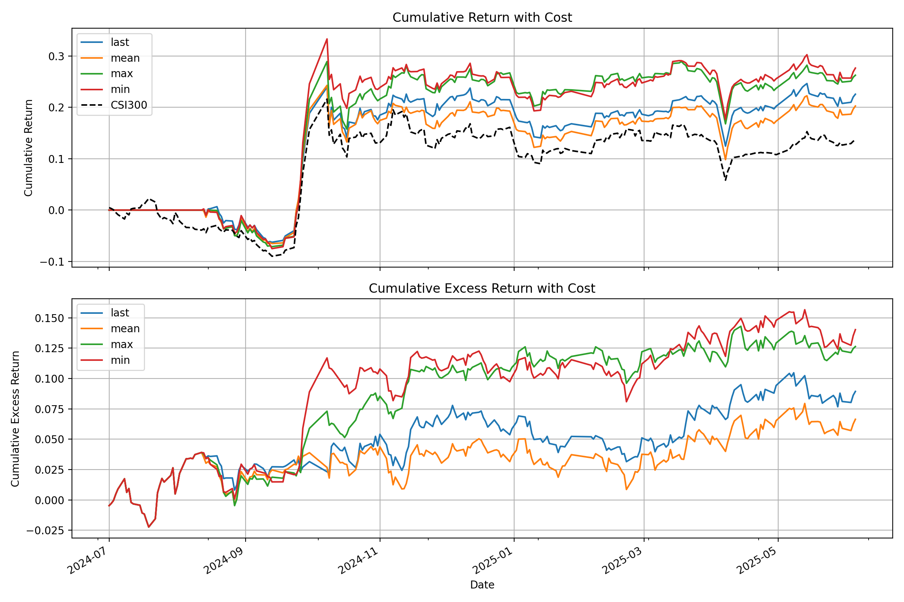

<div align="center">
  <h2><b>Kronos: A Foundation Model for the Language of Financial Markets </b></h2>
</div>


<div align="center">

</a> 
<a href="https://huggingface.co/NeoQuasar"> 
 
</a> 
<a href="https://shiyu-coder.github.io/Kronos-demo/">  </a>
<a href="https://github.com/shiyu-coder/Kronos/graphs/commit-activity"> 
 
</a> 
<a href="https://github.com/shiyu-coder/Kronos/stargazers"> 
 
</a> 
<a href="https://github.com/shiyu-coder/Kronos/network/members"> 
 
</a> 
<a href="./LICENSE"> 
 
</a>

</div>

<div align="center">
  <!-- Keep these links. Translations will automatically update with the README. -->
  <a href="https://zdoc.app/de/shiyu-coder/Kronos">Deutsch</a> | 
  <a href="https://zdoc.app/es/shiyu-coder/Kronos">Español</a> | 
  <a href="https://zdoc.app/fr/shiyu-coder/Kronos">Français</a> | 
  <a href="https://zdoc.app/ja/shiyu-coder/Kronos">日本語</a> | 
  <a href="https://zdoc.app/ko/shiyu-coder/Kronos">한국어</a> | 
  <a href="https://zdoc.app/pt/shiyu-coder/Kronos">Português</a> | 
  <a href="https://zdoc.app/ru/shiyu-coder/Kronos">Русский</a> | 
  <a href="https://zdoc.app/zh/shiyu-coder/Kronos">中文</a>
</div>

<p align="center">



</p>

> Kronos is the **first open-source foundation model** for financial candlesticks (K-lines), 
> trained on data from over **45 global exchanges**.


</div>

## ⚡ Automated App — Quick Start

> **Windows, fastest way:** double-click **`RUN_ME.bat`** in the project folder. On the first run it
> installs Python (if missing), all packages and the Kronos model, asks for your API keys, checks
> them, opens the live dashboard in your browser and starts the trading bot (Binance in safe *test* mode).
> Afterwards the same double-click starts everything again in under a minute.

This repo is set up as a ready-to-run app: one command installs everything, downloads the models and runs a test forecast.

```bash
# Linux / macOS
./scripts/setup.sh          # venv + deps + model download + smoke-test forecast
source .venv/bin/activate
make serve                  # Web UI  -> http://localhost:7070
make run                    # batch forecast of every symbol in automation/config.yaml
make test                   # regression + automation tests
make finetune               # quick fine-tune on the bundled CSV
make examples               # run the example scripts
```

```bat
:: Windows
scripts\setup.bat
scripts\start.bat           :: Web UI -> http://localhost:7070
```

```bash
# Docker
docker compose up -d web                       # Web UI on :7070
docker compose run --rm forecaster             # one batch forecast -> ./outputs/latest
docker compose --profile schedule up -d        # re-forecast every hour
```

### Automation CLI

| Command | What it does |
|---|---|
| `python -m automation.kronos_auto fetch --source yfinance --symbol AAPL --interval 1d --period 3y` | Download K-lines into `data/` (Yahoo Finance: stocks, indices, FX, crypto) |
| `python -m automation.kronos_auto fetch --source binance --symbol BTCUSDT --interval 1h --limit 1000` | Download crypto K-lines from Binance (falls back to binance.us) |
| `python -m automation.kronos_auto forecast --csv data/AAPL_1d.csv --pred-len 20` | Forecast one CSV |
| `python -m automation.kronos_auto run` | Forecast every enabled symbol in `automation/config.yaml` |
| `python -m automation.kronos_auto run --every 60` | Same, repeating every 60 minutes |
| `python -m automation.kronos_auto setup-models --all` | Pre-download all model weights |
| `python -m automation.kronos_auto serve --port 7070` | Start the web UI |
| `python -m automation.kronos_auto alert-test` | Send a test alert to every configured channel |
| `python -m automation.kronos_auto account` | Show the auto-trading account and recent trades |
| `python -m automation.kronos_auto configure` / `check` | Enter API keys (hidden) / test all connections and key safety |
| `python -m automation.kronos_auto live` | Real-time trading bot on Binance / Alpaca (`automation/live.yaml`) |
| `python -m automation.kronos_auto live-status [--stop / --resume]` | Bot positions, PnL, trades; kill switch |

Every run writes to `outputs/<timestamp>/` (copied to `outputs/latest/`):

- `<SYMBOL>_forecast.csv` — mean forecast (OHLCV + amount) for the next `pred_len` bars
- `<SYMBOL>_forecast.png` — history + forecast + 10–90% band across `sample_count` sampled paths
- `<SYMBOL>_backtest.png` — the same model run on the most recent hidden window vs. what actually happened
- `summary.json` / `summary.md` — last close, forecast close, % change, share of paths ending up, UP/DOWN/FLAT signal, backtest MAPE and direction hit

Edit `automation/config.yaml` to choose the model (`kronos-mini` / `kronos-small` / `kronos-base`), device, lookback, horizon and the symbols to track. Live symbols (BTC, AAPL, S&P 500) are included but `enabled: false`; set `enabled: true` once you have internet access to the data providers. Any CSV with `timestamps, open, high, low, close[, volume, amount]` columns dropped into `data/` is usable from both the CLI and the web UI.

### Alerts (Telegram, email, Discord, Slack)

Copy `.env.example` to `.env` and fill in the channels you use, then set `alerts.enabled: true` in
`automation/config.yaml`. Every `run` then sends a summary (signal, % change, share of paths up,
backtest error, any orders) plus the forecast charts. Filter with `only_signals: [UP, DOWN]` or
`min_abs_change_pct`. Check the setup with:

```bash
python -m automation.kronos_auto alert-test
```

- **Telegram:** create a bot with @BotFather → `TELEGRAM_BOT_TOKEN`; message the bot, then get your chat id from `https://api.telegram.org/bot<token>/getUpdates` → `TELEGRAM_CHAT_ID`.
- **Email:** any SMTP account (`SMTP_HOST`, `SMTP_USER`, `SMTP_PASSWORD`, `ALERT_EMAIL_TO`). For Gmail use an App Password.
- **Discord / Slack:** create an incoming webhook in the channel settings → `DISCORD_WEBHOOK_URL` / `SLACK_WEBHOOK_URL` (Slack gets text only; charts can't be attached to Slack webhooks).

### Auto-trading (paper by default)

Set `trading.enabled: true` and give the symbols you want traded a `trade_symbol`. Each run then:
buys `order_notional` when the forecast change is at least `buy_threshold_pct` **and** at least
`min_paths_agree_pct` of the sampled paths agree; closes the position when the forecast is at or below
`sell_threshold_pct` with the same agreement. It is long-only, capped by `max_position_notional` and
`max_orders_per_run`, skips stale data (`max_data_age_hours`), and logs every order to `outputs/trades.csv`.

| `broker` | What happens |
|---|---|
| `paper` (default) | Simulated account in `outputs/paper_account.json`; no API, no money |
| `alpaca` | Orders on your Alpaca **paper** account (`ALPACA_API_KEY`, `ALPACA_SECRET_KEY`) |
| `alpaca` + `live: true` + env `KRONOS_ALLOW_LIVE_TRADING=yes` | **Real money.** Both switches are required |

Use `dry_run: true` to see decisions without placing orders, and
`python -m automation.kronos_auto account` to view the account and recent trades.

> ⚠️ Kronos forecasts are noisy. Backtest results (`Backtest MAPE`, `Direction ok` in each report)
> on a single window say little about future profits. Run on paper for a long time before risking money;
> you are responsible for any trades.

### Real-time trading bot (Binance + Alpaca, on your Windows PC)

`python -m automation.kronos_auto live` runs continuously: right after every 5-minute candle closes it
pulls fresh candles from the broker, runs Kronos (about 5 seconds per symbol on a CPU), applies the risk
rules and places orders. Settings are in `automation/live.yaml`.

**Setup on Windows**

1. Install Python 3.10+ from python.org (tick "Add python.exe to PATH").
2. Unzip the project, double-click `scripts\setup.bat`.
3. Double-click `scripts\configure.bat` and paste your keys when asked (input is hidden; they are
   saved only in `.env` on your PC). It then tests every connection and warns if your Binance key
   has withdrawals enabled, isn't IP-restricted, or your PC clock is off. Re-test any time with
   `scripts\check.bat`. On Binance, give the key **Spot trading only, withdrawals disabled,
   restricted to your IP**.
4. Double-click `scripts\start_live.bat`. The window shows each decision; everything is also logged
   to `outputs\live\live.log` and `outputs\live\live_trades.csv`.
5. Optional: right-click `scripts\install_autostart.ps1` → *Run with PowerShell* to start the bot
   automatically at every Windows log-in (the bot also keeps the PC from sleeping while it runs).

**Going from safe to real money - one step at a time**

| Step | `automation/live.yaml` | `.env` | What happens |
|---|---|---|---|
| 1 | `binance: {mode: test}` (default) | - | Real Binance prices; every order is checked by Binance's `/order/test` (proves your key works) but **nothing is bought**. Positions are simulated. |
| 2 | `binance: {mode: testnet}` | `BINANCE_TESTNET_*` keys | Orders execute on Binance's practice exchange with fake funds. |
| 3 | `binance: {mode: live}` | `KRONOS_ALLOW_LIVE_TRADING=yes` | **Real orders with real money.** Keep `order_notional` small at first. |
| - | `alpaca: {mode: paper}` | Alpaca paper keys (`PK...`) | US stocks on Alpaca's paper account, only while the market is open. |

Without `KRONOS_ALLOW_LIVE_TRADING=yes` the bot refuses to start in Binance live mode, and Alpaca
falls back to paper.

**Risk controls** (in `risk:`, per symbol overrides allowed): buy only when the forecast is above
`buy_threshold_pct` *and* `min_paths_agree_pct` of the sampled paths agree; per-order and
per-symbol money caps; `stop_loss_pct` / `take_profit_pct` exits that always apply; `max_daily_loss`
and `max_trades_per_day` limits; `cooldown_bars` between trades. The bot is long-only and **only
ever sells what it bought itself** - coins or shares you already held are never touched.

**Control while running**

- Live dashboard: start the web UI (`scripts\start.bat`) and open http://localhost:7070/live -
  positions, today's PnL, trades, the log, and a *Stop new buys* button.

- `scripts\live_status.bat` - positions held by the bot, today's PnL, recent trades
- `scripts\stop_buying.bat` - kill switch: no new buys (exits still work); `scripts\resume_buying.bat` undoes it
- Close the bot window (or Ctrl+C) to stop it completely. Open positions stay open on the exchange.

> ⚠️ Real-money trading can lose money quickly, including through fees (Binance charges ~0.1% per
> trade) and bugs or outages. Kronos's short-term forecasts are uncertain. Run step 1 for days,
> then small amounts, and only trade what you can afford to lose.

### Login and hosting

Set `KRONOS_USERS=you:password` and `KRONOS_SECRET_KEY` (see `.env.example`) to require a sign-in
for the web UI; without them the UI is open, which is fine on your own computer only. The UI also
lets signed-in users upload their own CSV files.

Ready-made deployments — any VPS with automatic HTTPS, Hugging Face Spaces (free), Render, and
Railway — are described step by step in [deploy/README.md](deploy/README.md).

### Fine-tuning on your own data

```bash
make finetune                 # quick CPU smoke run on the bundled Alibaba 5-min CSV (~1 min)
make finetune-full GPUS=2     # full run with finetune_csv/configs/config_ali09988_candle-5min.yaml
python -m automation.kronos_auto finetune --config path/to/your_config.yaml
```

Copy `finetune_csv/configs/config_quick_cpu.yaml`, point `data_path` at your CSV (paths are relative to the repo root; pretrained models can be Hugging Face ids) and remove the `max_*_samples` caps for a real run. Fine-tuned models are saved under `finetune_csv/finetuned/<exp_name>/`, show up automatically in the web UI's model list, and can be used for batch forecasts by setting `model_path` / `tokenizer_path` in `automation/config.yaml`.

**Qlib A-share pipeline** (`finetune/`): `make qlib-pipeline` (or `./finetune/run_pipeline.sh`) installs `pyqlib`, downloads the Qlib CN dataset, preprocesses it, fine-tunes tokenizer + predictor with `torchrun` (NCCL on GPUs, gloo on CPU) and runs the top-K backtest. Settings are in `finetune/config.py` and can be overridden with env vars (`QLIB_DATA_PATH`, `KRONOS_FT_EPOCHS`, `KRONOS_FT_BATCH_SIZE`, `KRONOS_FT_INSTRUMENT`, ...). Pretrained models default to the Hugging Face releases; Comet ML logging turns on when `COMET_API_KEY` is set.

### Example scripts

`make examples` runs `examples/prediction_example.py`, `prediction_wo_vol_example.py` and `prediction_batch_example.py` from any directory, using `data/XSHG_5min_600977.csv` if you add it, otherwise the bundled sample; charts are saved to `outputs/`.

The Chinese A-share scripts need `pip install -r requirements-cn.txt` and access to AkShare/East Money/Baostock. They read and write under `examples/` (`examples/data`, `examples/yuce`, ...) and use the GPU automatically when present. Pick the stock with an env var instead of editing code:

```bash
KRONOS_STOCK_CODE=600519 python examples/get_akshare_date_2024-2025_x.py   # download -> examples/data/600519_stock_data.csv
KRONOS_STOCK_CODE=600519 python examples/prediction_akshare_2024-2025.py    # forecast -> examples/yuce/
KRONOS_STOCK_CODE=600519 python examples/prediction_new.py                  # forecast + market-factor analysis
KRONOS_STOCK_CODE=600519 python examples/yuce/historical_backtest.py        # rolling Kronos backtest vs buy & hold
python examples/prediction_new_GUI.py                                        # Tkinter desktop GUI
```

If every data source fails, the download scripts stop instead of saving made-up prices; set `KRONOS_ALLOW_SAMPLE_DATA=1` to generate clearly-labelled simulated data for demos. `historical_backtest.py` now uses Kronos itself (`KRONOS_BACKTEST_BASELINE=1` switches back to the random-walk baseline for comparison).

### CI / scheduled runs (GitHub Actions)

- `.github/workflows/ci.yml` — runs the tests and a smoke forecast on every push / PR.
- `.github/workflows/scheduled-forecast.yml` — daily (01:17 UTC) or manual run that forecasts the configured symbols, posts the report as the job summary and uploads charts/CSVs as a build artifact.

> Forecasts are model outputs for research purposes, not financial advice.

## 📰 News
*   🚩 **[2025.11.10]** Kronos has been accpeted by AAAI 2026.
*   🚩 **[2025.08.17]** We have released the scripts for fine-tuning! Check them out to adapt Kronos to your own tasks.
*   🚩 **[2025.08.02]** Our paper is now available on [arXiv](https://arxiv.org/abs/2508.02739)!

<p align="center">

## 📜 Introduction

**Kronos** is a family of decoder-only foundation models, pre-trained specifically for the "language" of financial markets—K-line sequences. Unlike general-purpose TSFMs, Kronos is designed to handle the unique, high-noise characteristics of financial data. It leverages a novel two-stage framework: 
1. A specialized tokenizer first quantizes continuous, multi-dimensional K-line data (OHLCV) into **hierarchical discrete tokens**. 
2. A large, autoregressive Transformer is then pre-trained on these tokens, enabling it to serve as a unified model for diverse quantitative tasks.

<p align="center">
    
</p>

## ✨ Live Demo 
We have set up a live demo to visualize Kronos's forecasting results. The webpage showcases a forecast for the **BTC/USDT** trading pair over the next 24 hours. 

**👉 [Access the Live Demo Here](https://shiyu-coder.github.io/Kronos-demo/)** 

## 📦 Model Zoo 
We release a family of pre-trained models with varying capacities to suit different computational and application needs. All models are readily accessible from the Hugging Face Hub.

| Model        | Tokenizer                                                                       | Context length | Params  | Open-source                                                               |
|--------------|---------------------------------------------------------------------------------| -------------- | ------ |---------------------------------------------------------------------------|
| Kronos-mini  | [Kronos-Tokenizer-2k](https://huggingface.co/NeoQuasar/Kronos-Tokenizer-2k)     | 2048           | 4.1M   | ✅ [NeoQuasar/Kronos-mini](https://huggingface.co/NeoQuasar/Kronos-mini)  |
| Kronos-small | [Kronos-Tokenizer-base](https://huggingface.co/NeoQuasar/Kronos-Tokenizer-base) | 512            | 24.7M  | ✅ [NeoQuasar/Kronos-small](https://huggingface.co/NeoQuasar/Kronos-small) |
| Kronos-base  | [Kronos-Tokenizer-base](https://huggingface.co/NeoQuasar/Kronos-Tokenizer-base) | 512            | 102.3M | ✅ [NeoQuasar/Kronos-base](https://huggingface.co/NeoQuasar/Kronos-base)   |
| Kronos-large | [Kronos-Tokenizer-base](https://huggingface.co/NeoQuasar/Kronos-Tokenizer-base) | 512            | 499.2M | ❌                                                                         |


## 🚀 Getting Started

### Installation

1. Install Python 3.10+, and then install the dependencies:

```shell
pip install -r requirements.txt
```

### 📈 Making Forecasts

Forecasting with Kronos is straightforward using the `KronosPredictor` class. It handles data preprocessing, normalization, prediction, and inverse normalization, allowing you to get from raw data to forecasts in just a few lines of code.

**Important Note**: The `max_context` for `Kronos-small` and `Kronos-base` is **512**. This is the maximum sequence length the model can process. For optimal performance, it is recommended that your input data length (i.e., `lookback`) does not exceed this limit. The `KronosPredictor` will automatically handle truncation for longer contexts.

Here is a step-by-step guide to making your first forecast.

#### 1. Load the Tokenizer and Model

First, load a pre-trained Kronos model and its corresponding tokenizer from the Hugging Face Hub.

```python
from model import Kronos, KronosTokenizer, KronosPredictor

# Load from Hugging Face Hub
tokenizer = KronosTokenizer.from_pretrained("NeoQuasar/Kronos-Tokenizer-base")
model = Kronos.from_pretrained("NeoQuasar/Kronos-small")
```

#### 2. Instantiate the Predictor

Create an instance of `KronosPredictor`, passing the model, tokenizer, and desired device.

```python
# Initialize the predictor
predictor = KronosPredictor(model, tokenizer, max_context=512)
```

#### 3. Prepare Input Data

The `predict` method requires three main inputs:
-   `df`: A pandas DataFrame containing the historical K-line data. It must include columns `['open', 'high', 'low', 'close']`. `volume` and `amount` are optional.
-   `x_timestamp`: A pandas Series of timestamps corresponding to the historical data in `df`.
-   `y_timestamp`: A pandas Series of timestamps for the future periods you want to predict.

```python
import pandas as pd

# Load your data
df = pd.read_csv("./data/XSHG_5min_600977.csv")
df['timestamps'] = pd.to_datetime(df['timestamps'])

# Define context window and prediction length
lookback = 400
pred_len = 120

# Prepare inputs for the predictor
x_df = df.loc[:lookback-1, ['open', 'high', 'low', 'close', 'volume', 'amount']]
x_timestamp = df.loc[:lookback-1, 'timestamps']
y_timestamp = df.loc[lookback:lookback+pred_len-1, 'timestamps']
```

#### 4. Generate Forecasts 

Call the `predict` method to generate forecasts. You can control the sampling process with parameters like `T`, `top_p`, and `sample_count` for probabilistic forecasting.

```python
# Generate predictions
pred_df = predictor.predict(
    df=x_df,
    x_timestamp=x_timestamp,
    y_timestamp=y_timestamp,
    pred_len=pred_len,
    T=1.0,          # Temperature for sampling
    top_p=0.9,      # Nucleus sampling probability
    sample_count=1  # Number of forecast paths to generate and average
)

print("Forecasted Data Head:")
print(pred_df.head())
```

The `predict` method returns a pandas DataFrame containing the forecasted values for `open`, `high`, `low`, `close`, `volume`, and `amount`, indexed by the `y_timestamp` you provided.

For efficient processing of multiple time series, Kronos provides a `predict_batch` method that enables parallel prediction on multiple datasets simultaneously. This is particularly useful when you need to forecast multiple assets or time periods at once.

```python
# Prepare multiple datasets for batch prediction
df_list = [df1, df2, df3]  # List of DataFrames
x_timestamp_list = [x_ts1, x_ts2, x_ts3]  # List of historical timestamps
y_timestamp_list = [y_ts1, y_ts2, y_ts3]  # List of future timestamps

# Generate batch predictions
pred_df_list = predictor.predict_batch(
    df_list=df_list,
    x_timestamp_list=x_timestamp_list,
    y_timestamp_list=y_timestamp_list,
    pred_len=pred_len,
    T=1.0,
    top_p=0.9,
    sample_count=1,
    verbose=True
)

# pred_df_list contains prediction results in the same order as input
for i, pred_df in enumerate(pred_df_list):
    print(f"Predictions for series {i}:")
    print(pred_df.head())
```

**Important Requirements for Batch Prediction:**
- All series must have the same historical length (lookback window)
- All series must have the same prediction length (`pred_len`)
- Each DataFrame must contain the required columns: `['open', 'high', 'low', 'close']`
- `volume` and `amount` columns are optional and will be filled with zeros if missing

The `predict_batch` method leverages GPU parallelism for efficient processing and automatically handles normalization and denormalization for each series independently.

#### 5. Example and Visualization

For a complete, runnable script that includes data loading, prediction, and plotting, please see [`examples/prediction_example.py`](examples/prediction_example.py).

Running this script will generate a plot comparing the ground truth data against the model's forecast, similar to the one shown below:

<p align="center">
    
</p>

Additionally, we provide a script that makes predictions without Volume and Amount data, which can be found in [`examples/prediction_wo_vol_example.py`](examples/prediction_wo_vol_example.py).


## 🔧 Finetuning on Your Own Data (A-Share Market Example)

We provide a complete pipeline for finetuning Kronos on your own datasets. As an example, we demonstrate how to use [Qlib](https://github.com/microsoft/qlib) to prepare data from the Chinese A-share market and conduct a simple backtest.

> **Disclaimer:** This pipeline is intended as a demonstration to illustrate the finetuning process. It is a simplified example and not a production-ready quantitative trading system. A robust quantitative strategy requires more sophisticated techniques, such as portfolio optimization and risk factor neutralization, to achieve stable alpha.

The finetuning process is divided into four main steps:

1.  **Configuration**: Set up paths and hyperparameters.
2.  **Data Preparation**: Process and split your data using Qlib.
3.  **Model Finetuning**: Finetune the Tokenizer and the Predictor models.
4.  **Backtesting**: Evaluate the finetuned model's performance.

### Prerequisites

1.  First, ensure you have all dependencies from `requirements.txt` installed.
2.  This pipeline relies on `qlib`. Please install it:
    ```shell
      pip install pyqlib
    ```
3.  You will need to prepare your Qlib data. Follow the [official Qlib guide](https://github.com/microsoft/qlib) to download and set up your data locally. The example scripts assume you are using daily frequency data.

### Step 1: Configure Your Experiment

All settings for data, training, and model paths are centralized in `finetune/config.py`. Before running any scripts, please **modify the following paths** according to your environment:

*   `qlib_data_path`: Path to your local Qlib data directory.
*   `dataset_path`: Directory where the processed train/validation/test pickle files will be saved.
*   `save_path`: Base directory for saving model checkpoints.
*   `backtest_result_path`: Directory for saving backtesting results.
*   `pretrained_tokenizer_path` and `pretrained_predictor_path`: Paths to the pre-trained models you want to start from (can be local paths or Hugging Face model names).

You can also adjust other parameters like `instrument`, `train_time_range`, `epochs`, and `batch_size` to fit your specific task. If you don't use [Comet.ml](https://www.comet.com/), set `use_comet = False`.

### Step 2: Prepare the Dataset

Run the data preprocessing script. This script will load raw market data from your Qlib directory, process it, split it into training, validation, and test sets, and save them as pickle files.

```shell
python finetune/qlib_data_preprocess.py
```

After running, you will find `train_data.pkl`, `val_data.pkl`, and `test_data.pkl` in the directory specified by `dataset_path` in your config.

### Step 3: Run the Finetuning

The finetuning process consists of two stages: finetuning the tokenizer and then the predictor. Both training scripts are designed for multi-GPU training using `torchrun`.

#### 3.1 Finetune the Tokenizer

This step adjusts the tokenizer to the data distribution of your specific domain.

```shell
# Replace NUM_GPUS with the number of GPUs you want to use (e.g., 2)
torchrun --standalone --nproc_per_node=NUM_GPUS finetune/train_tokenizer.py
```

The best tokenizer checkpoint will be saved to the path configured in `config.py` (derived from `save_path` and `tokenizer_save_folder_name`).

#### 3.2 Finetune the Predictor

This step finetunes the main Kronos model for the forecasting task.

```shell
# Replace NUM_GPUS with the number of GPUs you want to use (e.g., 2)
torchrun --standalone --nproc_per_node=NUM_GPUS finetune/train_predictor.py
```

The best predictor checkpoint will be saved to the path configured in `config.py`.

### Step 4: Evaluate with Backtesting

Finally, run the backtesting script to evaluate your finetuned model. This script loads the models, performs inference on the test set, generates prediction signals (e.g., forecasted price change), and runs a simple top-K strategy backtest.

```shell
# Specify the GPU for inference
python finetune/qlib_test.py --device cuda:0
```

The script will output a detailed performance analysis in your console and generate a plot showing the cumulative return curves of your strategy against the benchmark, similar to the one below:

<p align="center">
    
</p>

### 💡 From Demo to Production: Important Considerations

*   **Raw Signals vs. Pure Alpha**: The signals generated by the model in this demo are raw predictions. In a real-world quantitative workflow, these signals would typically be fed into a portfolio optimization model. This model would apply constraints to neutralize exposure to common risk factors (e.g., market beta, style factors like size and value), thereby isolating the **"pure alpha"** and improving the strategy's robustness.
*   **Data Handling**: The provided `QlibDataset` is an example. For different data sources or formats, you will need to adapt the data loading and preprocessing logic.
*   **Strategy and Backtesting Complexity**: The simple top-K strategy used here is a basic starting point. Production-level strategies often incorporate more complex logic for portfolio construction, dynamic position sizing, and risk management (e.g., stop-loss/take-profit rules). Furthermore, a high-fidelity backtest should meticulously model transaction costs, slippage, and market impact to provide a more accurate estimate of real-world performance.

> **📝 AI-Generated Comments**: Please note that many of the code comments within the `finetune/` directory were generated by an AI assistant (Gemini 2.5 Pro) for explanatory purposes. While they aim to be helpful, they may contain inaccuracies. We recommend treating the code itself as the definitive source of logic.

## 📖 Citation

If you use Kronos in your research, we would appreciate a citation to our [paper](https://arxiv.org/abs/2508.02739):

```
@misc{shi2025kronos,
      title={Kronos: A Foundation Model for the Language of Financial Markets}, 
      author={Yu Shi and Zongliang Fu and Shuo Chen and Bohan Zhao and Wei Xu and Changshui Zhang and Jian Li},
      year={2025},
      eprint={2508.02739},
      archivePrefix={arXiv},
      primaryClass={q-fin.ST},
      url={https://arxiv.org/abs/2508.02739}, 
}
```

## 📜 License 
This project is licensed under the [MIT License](./LICENSE).


